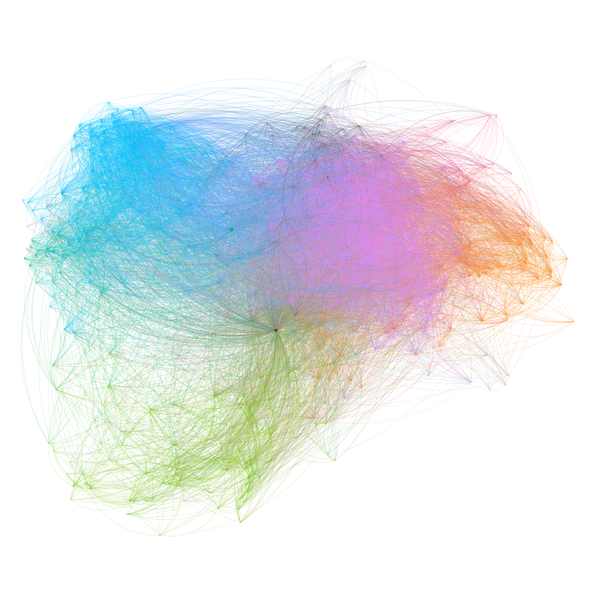
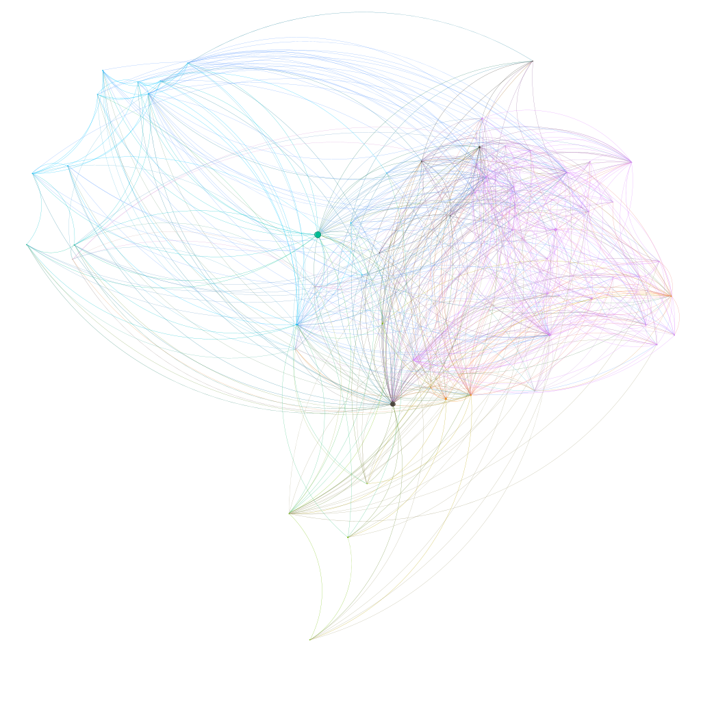
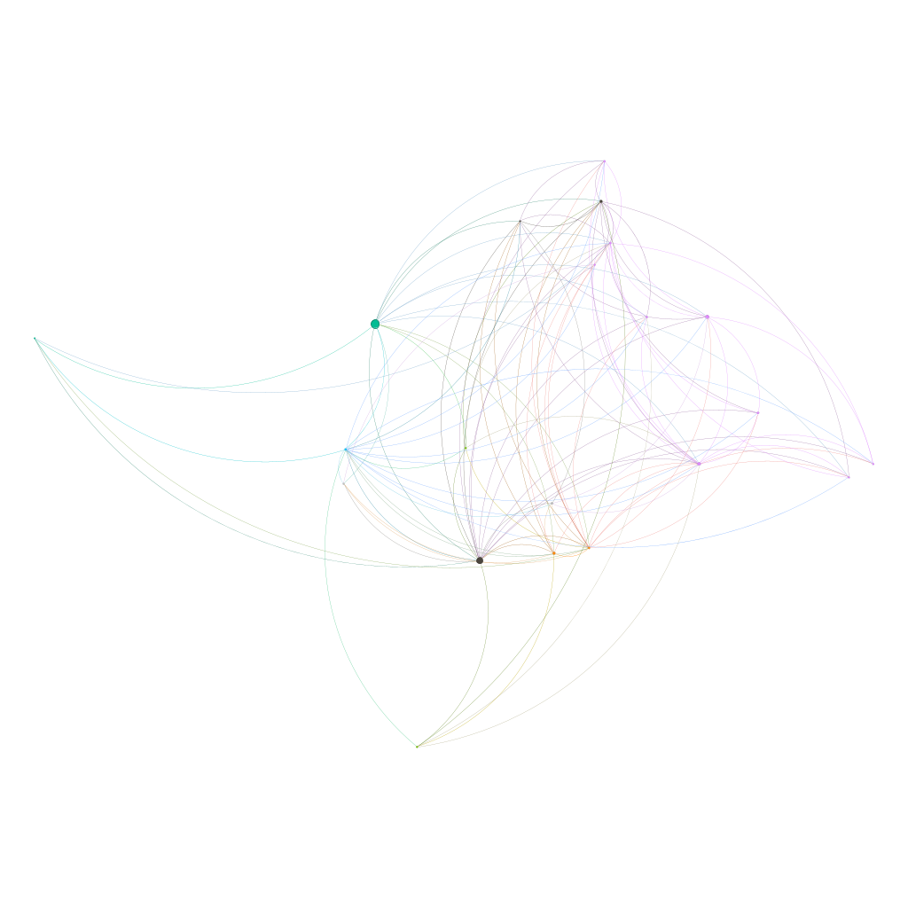

# ELE 568 — GitHub Sosyal Ağının Yapısal Analizi

**TOBB Ekonomi ve Teknoloji Üniversitesi**  
Elektrik-Elektronik Mühendisliği Bölümü  
ELE 568 Ağ Bilimi — Bahar 2026  
**Eda İnan | 221201076**

---

## Proje Hakkında

Bu çalışmada [SNAP — GitHub Social Network](https://snap.stanford.edu/data/github-social.html) 
veri seti kullanılarak 37.700 düğüm ve 289.003 kenarlı bir yazılım geliştirici 
sosyal ağının yapısal özellikleri analiz edilmiştir.

Ağ, kullanıcıların birbirini **karşılıklı takip etme (mutual follower)** 
ilişkileri üzerinden modellenmiş; Barabási'nin *Network Science* kitabındaki 
temel kavramlar çerçevesinde incelenmiştir.

---

## Araştırma Soruları

- GitHub ağı bir güç yasasına (power-law) mı tabidir, yoksa rastgele bir yapıda mıdır?
- Ağ, stratejik düğümlerin kaybına karşı ne kadar gürbüzdür?
- Yazılımcılar belirli teknolojik veya sosyal kümeler oluşturuyor mu?
- GitHub ağı hangi ağ üretim modeli (BA, ER) ile en iyi açıklanabilir?

---

## Bulgular

| Analiz | Sonuç |
|--------|-------|
| Derece Dağılımı | Scale-free özellik (γ ≈ 1.47) |
| Mesafe & Küçük Dünya | ⟨l⟩ = 3.26, small-world ✓ |
| Derece Korelasyonları | Hafif disassortative (r = -0.075) |
| Gürbüzlük | f_c(rastgele)=0.97, f_c(hedefli)=0.21 |
| Topluluk Analizi | 31 topluluk, modularity=0.453 |
| Model Karşılaştırması | BA modeli ER'den çok daha uyumlu |

---

## Kurulum
```bash
# Conda environment oluştur
conda create -n ele568 python=3.11
conda activate ele568

# Gerekli paketleri yükle
pip install networkx matplotlib numpy scipy pandas jupyter python-louvain
```

## Veri Seti

Veri seti SNAP'ten indirilmelidir:
```bash
mkdir data
cd data
wget https://snap.stanford.edu/data/git_web_ml.zip
unzip git_web_ml.zip
```

## Kullanım
```bash
jupyter notebook analiz.ipynb
```

---

## Ağ Görselleştirmeleri

Görselleştirmeler Gephi (ForceAtlas2 layout) ile oluşturulmuştur.  
Renkler Louvain algoritmasıyla tespit edilen topluluk sınıflarını göstermektedir.

| Derece Filtresi | Görsel |
|---|---|
| > 100 |  |
| > 500 |  |
| > 1000 |  |

---

## Rapor

Tam teknik rapor için: [📄 ELE568-Bahar2026-eda-inan-proje.pdf](report/ELE568-Bahar2026-eda-inan-proje.pdf)

---

## Veri Seti

[SNAP — GitHub Social Network](https://snap.stanford.edu/data/github-social.html)

> B. Rozemberczki, C. Allen, and R. Sarkar, "Multi-scale attributed node 
> embedding," Journal of Complex Networks, vol. 9, no. 2, 2021.

---

## Kaynaklar

- Barabási, A. L. (2016). *Network Science*. Cambridge University Press.
- Rozemberczki et al. (2019). Multi-scale Attributed Node Embedding. arXiv:1909.13021.
- Blondel et al. (2008). Fast unfolding of communities in large networks.
- Newman (2002). Assortative mixing in networks.

